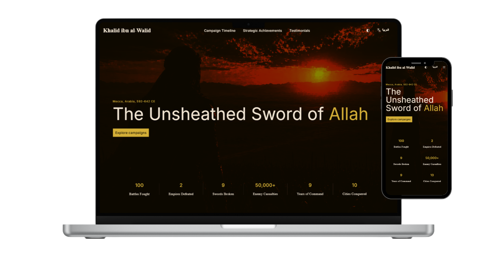
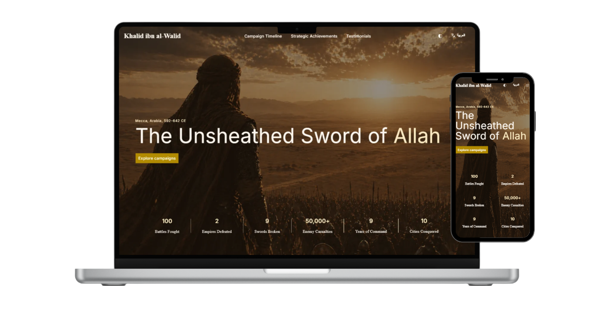

# ⚔️ Khalid ibn al-Walid: The Unbeaten Commander

A high-performance, multilingual biographical platform dedicated to the life and military legacy of Khalid ibn al-Walid. Built with a focus on modern web standards, accessibility, and fluid user experience.

[🔗 **View Live Demo**](https://mahmoudabdelaziz1993.github.io/Khalid-ibn-al-Walid/en)

---

## 📸 Screenshots

| Dark Mode | Light Mode |
| :---: | :---: |
|  |  |
| *Hero section with responsive background* | *Optimized mobile experience* |

---

## ✨ Features

- **🌍 Multilingual Support:** Fully localized in English and Arabic (RTL) using Next.js Internationalization (i18n).
- **🌗 Dark Mode:** Seamless theme switching with persistent user preferences.
- **📈 Animated Stats:** High-performance counter animations using Framer Motion (Motion/React).
- **⚡ Performance First:** Static site generation (SSG) for instant load times and perfect SEO scores.
- **📱 Fully Responsive:** Adaptive layout from ultra-wide desktops to mobile devices.
- **🎨 Modern UI:** Built with Tailwind CSS and Shadcn/ui for a polished, professional aesthetic.

---

## 🛠️ Tech Stack

- **Framework:** [Next.js 15+](https://nextjs.org/) (App Router)
- **Styling:** [Tailwind CSS](https://tailwindcss.com/)
- **Components:** [Shadcn/ui](https://ui.shadcn.com/)
- **Animations:** [Framer Motion](https://www.framer.com/motion/)
- **Icons:** [Lucide React](https://lucide.dev/)
- **Deployment:** [GitHub Pages](https://pages.github.com/) via GitHub Actions

---

## 🚀 Local Development

1. **Clone the repository:**
   ```bash
   git clone [https://github.com/mahmoudabdelaziz1993/Khalid-ibn-al-Walid.git](https://github.com/mahmoudabdelaziz1993/Khalid-ibn-al-Walid.git)
   cd Khalid-ibn-al-Walid